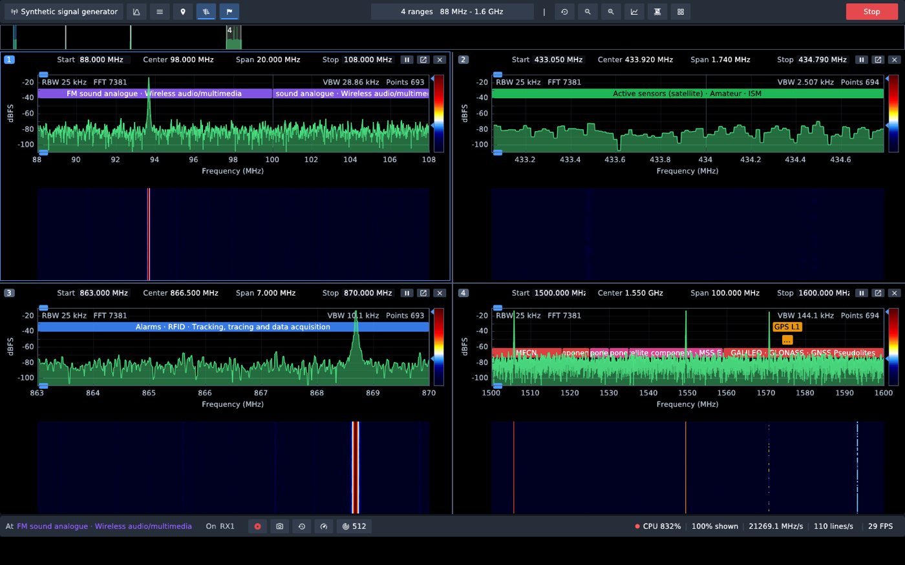
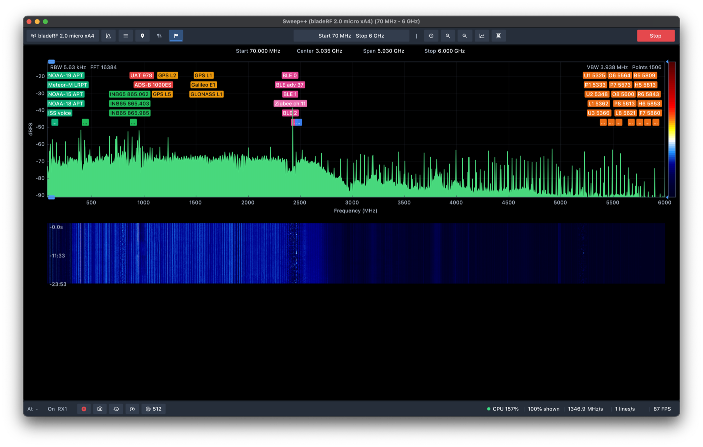

# Changelog

What changed in each release of Sweep++. The app shows the new entries as
**What's new** after an update.

## [0.2.0] - 2026-10-10

### New

- **Several panels at once.** Up to nine, each with its own zoom, levels and
  waterfall. **Mirror** shows the sweep in every panel; **Spans** gives each
  swept range a panel of its own, under an overview strip of the whole range.
- **Receiver corrections.** Learn the radio's own floor and spurs once, with
  the antenna off, and have them removed from every sweep.
- **Clock time in the History viewer.** Times read from the recording's start
  or as the clock time each line was captured.
- **What's new.** This window, after an update and from Menu → Application.

### Improved

- **Fit to ranges.** Zooms each Mirror panel onto a swept range.
- HackRF Pro is listed as supported, beside the HackRF One.

### Fixed

- The waterfall gets a row for every completed pass.
- The waterfall draws on Wayland.
- New panels start with the waterfall's history.
- Prompts stay in the main window; on macOS, file dialogs open as sheets on it.
- The History viewer's waterfall stays within the recording.

## [0.1.0] - 2026-09-13

The first release.

- Sweeps ranges far wider than the radio sees at once, stitched into one
  picture: a live spectrum with hold and average traces, and a waterfall that
  keeps full detail when zoomed.
- Several ranges in one sweep, with 12 built-in presets.
- Band-plan and channel labels, markers, and automatic signal detection.
- Every run recorded; play it back in the History viewer.
- Antennas per connector, switched by band on two-input radios.
- HackRF One, bladeRF, RTL-SDR and Fobos SDR.

[0.2.0]: https://github.com/aurimasniekis/sweeppp/compare/v0.1.0...v0.2.0
[0.1.0]: https://github.com/aurimasniekis/sweeppp/releases/tag/v0.1.0
