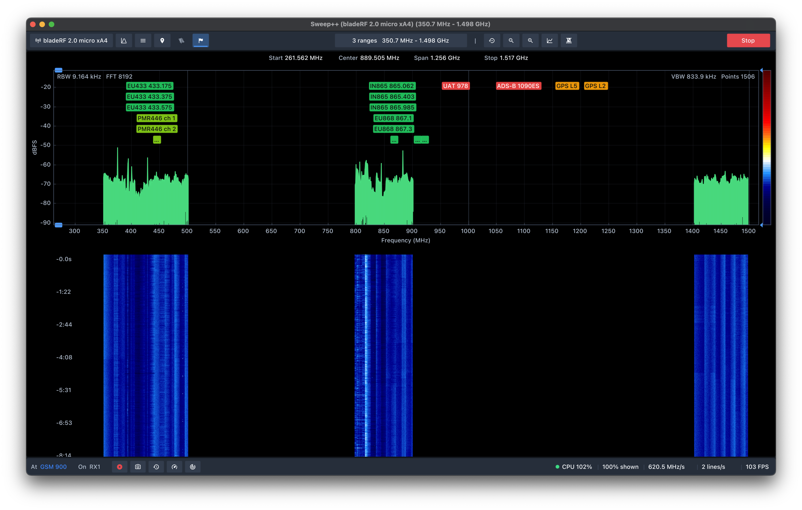

# Sweep++

Sweep++ is a desktop app that turns a software-defined radio (SDR) into a
wideband spectrum analyser. It sweeps across gigahertz of spectrum, shows what
is on the air, names it, and records everything so you can scroll back later.

It runs on macOS, Linux and Windows.


<sub>A bladeRF sweeping 70 MHz – 6 GHz with channel and band labels.</sub>

## What it does

### See the whole band at once

- Sweep a range much wider than your radio can see in one go. Sweep++ tunes
  step by step and stitches the pieces into one picture.
- Learn the receiver's own hump and spurs once, with the antenna off, and have
  them removed from every sweep.
- A live spectrum with max hold, min hold and average traces.
- A scrolling waterfall that keeps full detail when you zoom in.
- Zoom and pan with the mouse.

### Watch several ranges together

Sweep several separate ranges in one pass, and skip the empty space between
them. 12 built-in presets get you started: FM broadcast, airband, 2 m and 70 cm
amateur, ISM 433/868/915, LTE downlink, GPS L1, Wi-Fi 2.4 and 5 GHz, and the
full range.



### Know what you're looking at

- Band-plan labels for Europe (ECA) and ITU Region 1.
- Channel lists for Wi-Fi, cellular, LoRa/ISM, FPV video and beacons.
- Add your own channels.

### Find signals

- Markers with level readouts, and the difference between two markers.
- Automatic signal detection, with an activity history you can export to CSV.

### Record and replay

- Every run is recorded automatically.
- Save the session to a `.sweeps` file.
- Open it in the History viewer to play it back at any speed, jump around with
  the overview strip, and see exactly what was there.


### Antennas

- Tell Sweep++ which antenna is on which connector.
- On radios with two inputs it switches between them per band automatically.
- It warns you when an antenna needs bias-T power that isn't switched on.

### Make it yours

Dark, light and high-contrast themes, 12 colour maps and a gradient editor,
interface scaling, and saved profiles you can switch between.

### Snapshots

One click copies a PNG of the spectrum and waterfall to the clipboard.

## Supported devices

| Device                                    | Frequency range                                                             | Max sample rate                                           | Inputs                                  | Bias-T |
|-------------------------------------------|-----------------------------------------------------------------------------|-----------------------------------------------------------|-----------------------------------------|--------|
| HackRF One, HackRF Pro                    | 1 MHz – 6 GHz                                                               | 20 MS/s                                                   | 1                                       | yes    |
| bladeRF (x40/x115, 2.0 micro xA4/xA5/xA9) | 47 MHz – 6 GHz                                                              | 61.44 MS/s, more in 8-bit mode where the FPGA supports it | 2 on the 2.0 micro                      | yes    |
| RTL-SDR                                   | about 24 – 1766 MHz depending on the tuner, plus HF through direct sampling | 3.2 MS/s                                                  | tuner, and HF where the tuner allows it | yes    |
| Fobos SDR (standard and agile firmware)   | 50 MHz – 6.9 GHz                                                            | 80 MS/s                                                   | 1                                       | —      |
| Synthetic signal generator                | no hardware needed, for trying the app                                      |                                                           |                                         |        |

[Supported devices](docs/devices.md) has the full details for each one.

Want another radio supported? Pull requests are welcome, see
[plugin development](docs/plugin-development.md#writing-a-driver). Or, if you
can lend or send the hardware, open an issue and I'll develop support for it.

## Getting Sweep++

Downloads and install instructions are at [sweeppp.app](https://sweeppp.app).
The [latest release](https://github.com/aurimasniekis/sweeppp/releases/latest)
and the [nightly](https://github.com/aurimasniekis/sweeppp/releases/tag/nightly)
are on the GitHub Releases page. Each has:

- `.deb` packages for Ubuntu 24.04, Ubuntu 26.04 and Debian 13, for amd64 and
  arm64, plus a `.tar.gz` of each;
- a `.tar.gz` for macOS, for Apple silicon (`arm`) or Intel;
- a `.zip` for Windows x64.

**macOS.** Install from the Homebrew tap:

```bash
brew install aurimasniekis/sweeppp/sweeppp          # or aurimasniekis/sweeppp/sweeppp-nightly
```

Or unpack the `.tar.gz`. The build isn't signed, so macOS blocks it the first
time. Either open it once, then go to System Settings → Privacy & Security and
click *Open Anyway*, or run `xattr -dr com.apple.quarantine Sweep++.app` (or
`"Sweep++ Nightly.app"`) after unpacking. Sweep++ needs
`glfw` from [Homebrew](https://brew.sh) (`brew install glfw`), and when you
start it, it tells you which radio libraries to `brew install` for your
hardware.

**Debian and Ubuntu.** Add the apt repository, signed and served from the
site:

```bash
sudo install -d -m 0755 /etc/apt/keyrings
sudo curl -fsSL https://sweeppp.app/apt/sweeppp.gpg -o /etc/apt/keyrings/sweeppp.gpg
echo "deb [arch=$(dpkg --print-architecture) signed-by=/etc/apt/keyrings/sweeppp.gpg] https://sweeppp.app/apt $(. /etc/os-release && echo "$VERSION_CODENAME") main nightly" | sudo tee /etc/apt/sources.list.d/sweeppp.list
sudo apt update
sudo apt install sweeppp          # or sweeppp-nightly
```

Or install a downloaded package directly, for example
`sudo apt install ./sweeppp-0.2.0-ubuntu2404-amd64.deb`. The nightly package is
`sweeppp-nightly`, with `sweeppp-nightly-cli` beside `sweeppp-cli`.

**Windows** support is experimental. Unzip it and run `sweeppp.exe`. Run
`register-sweeps.cmd` once to open `.sweeps` files with Sweep++ when you
double-click them.

To build it yourself, see [Building from source](docs/build.md).

## First steps

1. Plug in your radio.
2. Click the device button at the top left and pick your radio. No radio yet?
   Pick **Synthetic signal generator**.
3. Click the range button in the middle of the top bar. Set a start and stop
   frequency, or pick a preset.
4. Click **Start**.
5. Right-click the spectrum to place a marker and read the level there. Scroll
   to zoom and drag to pan.

The [user guide](docs/user-guide.md) covers everything else.

## Plugins

Most of Sweep++ is built from plugins: the radio drivers, the FFT engines, the
band plans, the channel lists and signal detection. You can turn them on and
off in **Menu → Plugins**, and install plugins from other people. See
[Plugins](docs/plugins.md).

## Documentation

| Document                                                                | What's in it                                                              |
|-------------------------------------------------------------------------|---------------------------------------------------------------------------|
| [Changelog](CHANGELOG.md)                                               | What changed in each release                                              |
| [User guide](docs/user-guide.md)                                        | Every part of the app, and where settings are stored                      |
| [Supported devices](docs/devices.md)                                    | What each radio can do and how to set it up                               |
| [Plugins](docs/plugins.md)                                              | The bundled plugins, your own band plans and channels, installing plugins |
| [Command line](docs/cli.md)                                             | `sweeppp-cli` and `sweeps`, for scripts and headless use                  |
| [`.sweeps` files](docs/sweeps-files.md)                                 | Reading and writing recordings from other programs                        |
| [Building from source](docs/build.md)                                   | Requirements, presets, options and tests                                  |
| [Architecture](docs/architecture.md)                                    | How the code is organised and how data flows through it                   |
| [Plugin development](docs/plugin-development.md)                        | Writing your own plugin                                                   |
| [Third-party dependencies](THIRD_PARTY.md)                              | What Sweep++ uses and under which licences                                |
| [`.sweeps` format specification](lib/libsweepsfile/sweeps-format-v1.md) | The byte-level file format                                                |

## Licence

Sweep++ is licensed under GPL-3.0-or-later ([`LICENSE`](LICENSE)). The library
that reads and writes `.sweeps` files is MIT, so anyone can read your
recordings. [`THIRD_PARTY.md`](THIRD_PARTY.md) has the details.
