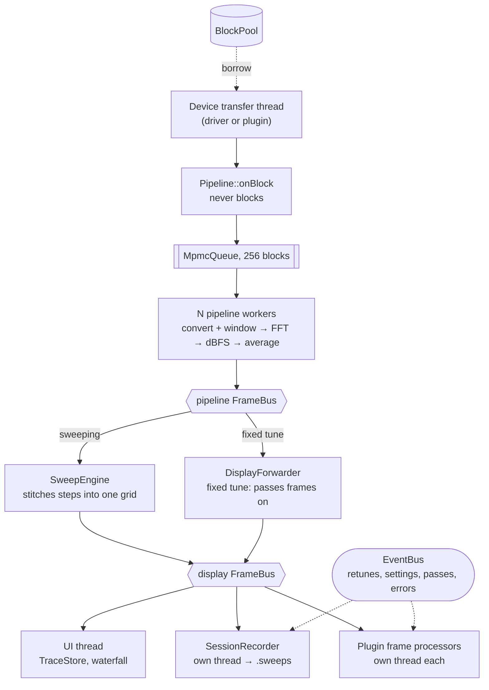

# Architecture

How the Sweep++ source is organised, and how samples become a spectrum on
screen and a recording on disk. This page is for people working on the code;
for using Sweep++, see the [user guide](user-guide.md).

- [Repository layout](#repository-layout)
- [libsweeppp modules](#libsweeppp-modules)
- [Data flow](#data-flow)
- [Sweep planning](#sweep-planning)
- [The History viewer](#the-history-viewer)
- [The plugin host](#the-plugin-host)
- [The GUI](#the-gui)
- [Licence boundaries](#licence-boundaries)
- [Further reading](#further-reading)

## Repository layout

```
lib/libsweepsfile/  the .sweeps container: format spec, reader, writer, C ABI,
                    Python binding and the `sweeps` tool.
                    MIT, C++17, no dependencies; builds and installs on its own.
lib/libsweeppp/     the core, as a static library. Links nothing GPL; every FFT
                    engine and every radio except two is a plugin.
                    core/ dsp/ fft/ sdr/ backends/ rf/ sweep/ pipeline/
                    history/ plugin/ profile/ ui/
bin/                sweeppp/         the desktop GUI
                    sweeppp-cli/     headless sweep, record, replay, info, extract
                    sweeppp-server/  placeholder for a future web interface
plugins/            bandplan/ channels/ detections/
                    fft-pocketfft/ fft-fftw/ fft-accelerate/
                    sdr-hackrf/ sdr-bladerf/ sdr-rtlsdr/ sdr-fobos/
resources/          built-in data, all TOML:
                    antennas/ bandplans/ channels/ themes/
                    colormaps/ (a README only; the colour maps are compiled in)
third_party/        gl/ (OpenGL 4.1 core loader) and imgui_config/ -- Sweep++'s
                    own code, despite the directory name
cmake/              dependency pins, warnings, sanitizers, the plugin helper
tools/              format.sh, tidy.sh, check-headers.sh
packaging/          windows/register-sweeps.cmd.in
tests/              host test suite and fixture plugins
```

Each plugin has its own `tests/` directory. Headers are under
`lib/libsweeppp/include/sweeppp/<module>/`, sources under
`lib/libsweeppp/src/<module>/`.

## libsweeppp modules

`libsweeppp` is a static library. It publicly links `sweeps::sweepsfile`,
toml++ and threads, and no FFT or radio library.

| Module      | What it does                                                                                                                                                                                 | Key types                                                                                                                       |
|-------------|----------------------------------------------------------------------------------------------------------------------------------------------------------------------------------------------|---------------------------------------------------------------------------------------------------------------------------------|
| `core/`     | Lock-free building blocks, events, telemetry, paths, TOML helpers, logging, crash handler, version.                                                                                          | `BlockPool`/`BlockRef`, `MpmcQueue`, `EventBus`, `Telemetry`, `Paths`, `toml_util`, `Log`, `CrashHandler`, `Result`/`Status`    |
| `dsp/`      | Sample-format conversion with the window applied in the same pass, magnitude to dBFS, fftshift.                                                                                              | `convertAndWindow`, `magnitudeToDbfs`                                                                                           |
| `fft/`      | The FFT abstraction and registry. It has no engines of its own; they all come from plugins. Also window functions and the benchmark.                                                         | `IFftBackend`, `IFftPlan`, `FftBackendManager`, `Window`, `FftBenchmark`                                                        |
| `sdr/`      | The radio abstraction. Devices push blocks borrowed from a pool; settings are generic so panels can be generated from them.                                                                  | `ISdrDevice`, `ISdrDeviceFactory`, `SdrDeviceManager`, `SdrParameter`/`SdrValue`, `SampleFormat`, `IqBlock`, `SdrRxPort`        |
| `backends/` | The two radios that need no external library: the synthetic generator and IQ-file replay.                                                                                                    | `registerBuiltinSdrDevices()`                                                                                                   |
| `rf/`       | What sits in front of the tuner: the antenna library, which antenna is on which input, switchers, and resolving that chain into routable legs.                                               | `AntennaLibrary`, `AntennaAssignments`, `IRfPath`, `RfPathManager`, `resolveRfPath()`, `RfLeg`                                  |
| `sweep/`    | The plan model, the planner that turns a plan into a schedule, the engine that tunes and stitches, presets, and back/forward range history.                                                  | `SweepPlan`/`SweepSegment`, `SweepPlanner`, `SweepSchedule`/`SweepStep`, `SweepEngine`, `SweepPresetStore`, `SweepRangeHistory` |
| `pipeline/` | Turns IQ blocks into spectrum frames and fans them out to consumers.                                                                                                                         | `Pipeline`, `PipelineConfig`, `FrameBus`, `IFrameConsumer`, `AsyncFrameConsumer`, `SpectrumFrame`                               |
| `history/`  | A thin layer over libsweepsfile: a threaded recorder and replay.                                                                                                                             | `session::SessionRecorder`, `SessionReplay`, `IFrameSource`                                                                     |
| `plugin/`   | The plugin host: search path, loading, manifests and dependencies, adapters from facets to host interfaces, events, contributors, UI dispatch. Also the headers plugins are written against. | `PluginManager`, `PluginAbi.h`, `Plugin.hpp`, `PluginSdr.hpp`, `PluginFft.hpp`, `PluginChrome.hpp`                              |
| `profile/`  | One TOML-backed struct for the whole setup. `settings.toml` and named profiles are the same type.                                                                                            | `Profile`                                                                                                                       |
| `ui/`       | UI state with no rendering in it.                                                                                                                                                            | `Theme`, `ColorMap`, `TraceStore`, `Marker`/`MarkerPresetStore`, `ToastCenter`, `ViewSettings`                                  |

## Data flow



1. **The device** borrows a block from the `BlockPool`, fills it with samples in
   the radio's own format, and hands it to `Pipeline::onBlock`. Nothing
   converts on the transfer thread.
2. **`Pipeline::onBlock` never blocks.** It drops blocks that arrived while the
   radio was still settling after a retune, applies the throttle, and pushes the
   rest onto an `MpmcQueue<IqBlock, 256>`. A full queue drops the block and
   counts it. Every place a block can be lost has its own counter, which is what
   the Performance window shows.
3. **N worker threads** (by default the core count minus two) take blocks,
   convert and window them in one pass, run the FFT, convert to dBFS, and
   average. Frames carry the *capture* time and centre frequency of their
   block, and are published in sequence order.
4. **The pipeline `FrameBus`** delivers each frame to its consumers one at a
   time and in order, so no consumer has to be thread-safe. Consumers must not
   block; a slow one drops frames and the bus counts them.
   - **When sweeping**, the consumer is the `SweepEngine`, which places each
     frame into the global frequency grid and publishes a stitched frame as each
     step lands, plus a final one flagged `passComplete`.
   - **When fixed-tuned**, a `DisplayForwarder` passes frames straight on.
5. **The display `FrameBus`** fans out to:
   - the **UI**, which keeps only the newest frame pointer and picks it up once
     per rendered frame to update the traces. While sweeping, the waterfall only
     advances on `passComplete` frames;
   - the **`SessionRecorder`**, an `AsyncFrameConsumer` with its own thread and
     queue, which writes the `.sweeps` file;
   - each **plugin frame processor**, also on its own thread.
6. **The `EventBus`** carries things that happen rather than frames: retunes,
   setting changes, sweep passes, throttle changes and device errors. The
   recorder writes them into the session, and the plugin host forwards them to
   plugins.

`sweeppp-cli sweep` uses the same arrangement, with a CSV writer on the bus in
place of the UI.

### Threads

- the device's transfer thread;
- N pipeline workers;
- the sweep engine thread, when sweeping;
- one thread per `AsyncFrameConsumer`: the recorder and each plugin frame
  processor;
- the UI and OpenGL main thread;
- short-lived worker threads for opening a device, saving a session and opening
  a history file.

## Sweep planning

A `SweepPlan` is one or more segments (ranges) plus the settings that apply to
all of them. Adding a segment that overlaps or touches another merges them.
`SweepPlanner::plan` turns a plan into a `SweepSchedule`, and is a pure function
of its arguments.

- **FFT size.** N = ⌈sample rate × window ENBW / RBW⌉, snapped to a size the FFT
  engine supports with `snapSize`. The actual RBW is recomputed from the snapped
  N.
- **One global grid** from the lowest to the highest frequency in the plan, with
  bins sample rate / N wide. The gaps between segments are bins nothing writes
  to.
- **Steps.** Only the middle `usableBandwidthFraction` of each step (0.75 by
  default) is kept, cropping the filter roll-off. The DC guard cuts a strip out
  of the centre, splitting each step into up to two bin ranges. The first step
  is placed so its usable band starts at the segment start; step centres are
  clamped to the radio's tuning range; steps are sorted by frequency, because
  the engine binary-searches them.
- **Timing estimate.** Each step costs the dwell time plus the larger of the
  collect time and the device's delivery granularity, plus the device's
  settle time after a retune, plus any modelled input-switch cost. The
  Analysis panel's **Predicted** readout is this estimate.

### Antenna routing

When routing by antenna, `SweepEngine::configure` calls `resolveRfPath`
(`rf/RfRouting.hpp`), which walks input → switcher → switcher input → antenna.
Each resulting leg's band is the antenna's coverage intersected with the limits
of the input and the radio. The operator's fallback input is added as a leg with
an empty band.

The planner's `choosePort` then picks an input per step from the band the step
keeps, using the plan's `PortStrategy` (tightest fit, port order, highest gain
or fewest switches). It counts the input changes per pass, including the wrap
back to the start, and records the ranges no leg covers.

### The engine loop

For each step, the sweep thread:

1. selects the step's input (and switcher input). If that requires a stop, it
   runs inside `Pipeline::cycleDeviceStream`, which restarts only the device's
   stream;
2. retunes, unless already on that frequency;
3. marks frames as valid only after the settle and switch time has passed;
4. waits for the dwell time, leaving early once a frame for this step has
   arrived;
5. publishes a partial frame (at most about 30 per second).

Meanwhile `SweepEngine::onFrame` finds each frame's step by its centre
frequency, drops frames from before the settle deadline, and stitches the rest.
Where steps overlap, the measurement that sat deepest inside its own step's
usable band wins. Every stitched frame is also handed to the engine's step
observer, which is how the correction learner sees each step's raw measurement.

### Receiver corrections

`correction/` holds three corrections the pipeline applies to every frame, so
fixed tune and sweep get them alike and plugins see the result:

- DC removal: `dsp::blockStats` yields each block's mean I/Q in the same pass
  as the clipping check, and `convertAndWindow` subtracts it before the window.
- Floor flattening: a `FloorShape` in dB against LO offset, 2048 points over
  the sample rate, resampled to the running bin width; applied relative to its
  median.
- Spur mask: `SpurEntry` at an LO offset or an absolute frequency; the bins
  under it are replaced by a line between the nearest measured neighbours.

The switches are an atomic byte on the pipeline; the set is a
`shared_ptr<const CorrectionSet>` read under the publish lock, applied on the
frame's own bins once its centre is known. `CorrectionLearner` keeps a running
mean in dB per local bin: smoothed, it is the floor; runs standing above that
smoothing by more than the floor's remaining scatter are spurs. A calibration is
bound to a `CalibrationContext` of every grid- or calibration-affecting device
parameter except the centre; a differing one leaves the floor out. Each radio's
set lives in `calibration/<driver>_<serial>.toml` under the config folder.

## The History viewer

- **A separate process.** The **History** button runs a second copy of the
  binary as `sweeppp --history [file]`. ImGui can only place a window on the
  desktop through its multi-viewport mode, which is global and would change
  how the main window works, so a separate process is simpler and changes
  nothing about the live instrument. `main.cpp` explains this in more detail.
- **Opening** happens on a worker thread; the `SessionReader` is then handed to
  `render/HistoryView`.
- **The main image.** `HistoryView::composite` asks
  `SessionReader::query` for the visible time and frequency range, with the
  pane's height and width as the maximum lines and bins. The reader chooses the
  coarsest level of detail that still fills the pane. Tiles from any segment
  are placed by their own geometry, combined by maximum, coloured once, and
  uploaded as a single texture, and only when the view changes.
- **The overview strip** queries the whole session over a band around the
  selected marker, with time across and frequency down. It is rebuilt only when
  the band, size or colours change.
- **The spectrum pane** reads `SessionReader::spectrumAt` at the playhead.
- **Playback** is driven by the wall clock in the window, not by
  `SessionReplay` (which only `sweeppp-cli replay` uses).
- Segments are always looked up by id, never by position.

## The plugin host

See [Plugin development](plugin-development.md) for the plugin author's side.

### Loading

1. **Discover.** Walk the [search path](plugin-development.md#where-plugins-are-found)
   in order. The first copy of an id wins; later copies are listed as shadowed.
2. **Open** the library, check `sweeppp_plugin_abi_version()`, and call
   `sweeppp_plugin_query(host_abi)` for the plugin's descriptor.
3. **Resolve.** Read the manifest, check `min_host_version`, and resolve
   dependencies (with minimum and maximum versions, and optional dependencies)
   in a loop until nothing changes.
4. **Activate.** Call `activate(host_api)`; the plugin registers its facets
   through the host API.

Any failure becomes a listed plugin with a `failureReason`, which is what the
Plugins panel and `sweeppp-cli info` show.

### Facets

Each registered facet is wrapped in an adapter that implements the host's own
interface, then registered where the host would register a built-in:

| Facet           | Becomes                                                                                       |
|-----------------|-----------------------------------------------------------------------------------------------|
| Frame processor | an `AsyncFrameConsumer` on the display bus                                                    |
| SDR device      | an `ISdrDevice` factory in `SdrDeviceManager`; its stream borrows blocks from the host's pool |
| FFT backend     | an `IFftBackend` in `FftBackendManager`                                                       |
| Contributor     | a source of band, channel and spot data, ranked by the operator's order                       |
| RF path         | an `IRfPath` factory in `RfPathManager` (no bundled plugin provides one)                      |
| UI extension    | drawing in named spots of the host's window, through the host's ImGui context                 |

A second plugin claiming a driver or backend name that is already taken is
refused.

### Events

Event types are reverse-DNS names, and payloads carry `struct_size` and a schema
version, so new event types need no ABI change. Host events live under
`sweeppp.`; a plugin may only publish under its own id. Handlers run on the
publishing thread. Plugins can also write their own records and events into the
open session.

### Why a C ABI

`libsweeppp` is static. A plugin that links it gets its own copy of every
singleton (`SdrDeviceManager`, `FftBackendManager`, `Paths`, `Log`), so anything
it registered through linkage would land in a registry the host never reads.
Everything therefore crosses through a C function table the host hands the
plugin, and plugins may link `libsweeppp` only for values. `PluginAbi.h` also
covers ABI stability (`struct_size`, append-only structs), lifetimes, and which
thread calls what.

### Never unloaded

Modules are never `dlclose`d. Disabling a plugin withdraws its facets and stops
its callbacks, but the image stays mapped until exit, because unmapping would
leave dangling pointers to vtables, `std::function` targets and exception types.
A facet that is in use (an acquired FFT engine, an open radio) refuses to be
withdrawn, which is what marks a plugin **restart needed**.

## The GUI

- **`main.cpp`** sets up logging and the crash handler, decides between the
  instrument and the History viewer, then runs the loop: `beginFrame`,
  `MainWindow::draw`, `endFrame`. Closing goes through the save prompt; on exit
  the state is stopped and settings saved.
- **`AppWindow`** owns GLFW with an OpenGL 4.1 core context, ImGui (docking
  branch) and ImPlot, fonts and icons, DPI scaling, file drops, frame capture
  for snapshots, and the ImGui binding lent to plugins. The GL loader is
  `third_party/gl/`; `third_party/imgui_config/sweeppp_imconfig.h` makes
  `ImDrawIdx` and `ImWchar` 32-bit, which plugins must match.
- **`AppState`** is the one place where threads meet. It owns both frame buses,
  the `Pipeline`, `SweepEngine`, the device, the `SessionRecorder`, antennas,
  `TraceStore`, themes, toasts, the profile and range history. It always
  records into a hidden working file in the sessions folder, and the operator
  decides later whether to keep it.
- **`MainWindow`** is split by screen region:
  - `MainWindow.cpp`: the root window, top bar, info row, the spectrum and
    waterfall split, status bar, toasts, and floating windows;
  - `MainWindowPlots.cpp`: the spectrum and waterfall plots, overlays and
    markers;
  - `MainWindowPanels.cpp`: the top-bar panels, menu sections, benchmark,
    Performance window, and the whole History viewer;
  - `ContributionOverlay.*`: hover and overflow lists for labels.
- **`render/`**:
  - `WaterfallRenderer`: a single-channel ring texture on the GPU, scrolled by
    UV offset and coloured through a lookup table in the shader;
  - `HistoryView`: the History viewer's CPU composite, uploaded as one texture.
- Also `Snapshot`, `FileDialog` (nativefiledialog-extended), `UpdateCheck`
  (libcurl) and `FftBenchmarkRunner`.

## Licence boundaries

Sweep++ is GPL-3.0-or-later, except `lib/libsweepsfile`, which is MIT. The
third-party GPL libraries are each linked only by their own plugin:

| Binary or library       | Licence          | Links                                                                                                                                                               |
|-------------------------|------------------|---------------------------------------------------------------------------------------------------------------------------------------------------------------------|
| `libsweepsfile`         | MIT              | nothing                                                                                                                                                             |
| `libsweeppp` (static)   | GPL-3.0-or-later | libsweepsfile, toml++ (MIT)                                                                                                                                         |
| `sweeppp`               | GPL-3.0-or-later | libsweeppp, ImGui and ImPlot (MIT), GLFW (Zlib), nativefiledialog-extended (Zlib), stb (MIT), GTK 3 on Linux (LGPL), libcurl and nlohmann/json for the update check |
| `sweeppp-cli`           | GPL-3.0-or-later | libsweeppp, the `sweeps` tool's core                                                                                                                                |
| `sweeppp-server`        | GPL-3.0-or-later | libsweeppp, nlohmann/json                                                                                                                                           |
| `fft-fftw` plugin       | GPL-3.0-or-later | **FFTW (GPL-2.0-or-later)**                                                                                                                                         |
| `sdr-hackrf` plugin     | GPL-3.0-or-later | **libhackrf (GPL-2.0-only)**                                                                                                                                        |
| `sdr-rtlsdr` plugin     | GPL-3.0-or-later | **librtlsdr (GPL-2.0-or-later)**                                                                                                                                    |
| `sdr-bladerf` plugin    | GPL-3.0-or-later | libbladeRF (LGPL-2.1-or-later)                                                                                                                                      |
| `sdr-fobos` plugin      | GPL-3.0-or-later | libusb (LGPL), libfobos and libfobos-sdr-agile (LGPL-2.1, static)                                                                                                   |
| `fft-pocketfft` plugin  | GPL-3.0-or-later | PocketFFT (BSD-3-Clause)                                                                                                                                            |
| `fft-accelerate` plugin | GPL-3.0-or-later | Accelerate (macOS system framework)                                                                                                                                 |

Every plugin also links `libsweeppp` statically, for values only. Building with
`-DSWEEPPP_WITH_FFTW=OFF -DSWEEPPP_WITH_HACKRF=OFF -DSWEEPPP_WITH_RTLSDR=OFF`
leaves out all third-party GPL code. [`THIRD_PARTY.md`](../THIRD_PARTY.md) has
the details.

## Further reading

The header comments explain the reasoning behind most of the design, and are
meant to be read:

| File                                                                                | Covers                                                       |
|-------------------------------------------------------------------------------------|--------------------------------------------------------------|
| `lib/libsweeppp/include/sweeppp/pipeline/Pipeline.hpp`                              | The threading model, throttle modes and worker count.        |
| `lib/libsweeppp/include/sweeppp/pipeline/FrameBus.hpp`                              | The consumer contract: non-blocking, serialised, drop-aware. |
| `lib/libsweeppp/include/sweeppp/pipeline/AsyncFrameConsumer.hpp`                    | Consumers that need their own thread.                        |
| `lib/libsweeppp/include/sweeppp/sdr/ISdrDevice.hpp`                                 | What a radio must and must not do.                           |
| `lib/libsweeppp/include/sweeppp/sweep/SweepEngine.hpp`                              | Stepping, settling and partial emission.                     |
| `lib/libsweeppp/include/sweeppp/rf/RfRouting.hpp`                                   | Resolving inputs, switchers and antennas into legs.          |
| `lib/libsweeppp/include/sweeppp/plugin/PluginAbi.h` (lines 1–120)                   | The plugin boundary, ABI stability, lifetimes and threads.   |
| `bin/sweeppp/src/render/HistoryView.hpp`                                            | Drawing a session of any length from the pyramid.            |
| [`lib/libsweepsfile/sweeps-format-v1.md`](../lib/libsweepsfile/sweeps-format-v1.md) | The `.sweeps` format.                                        |
