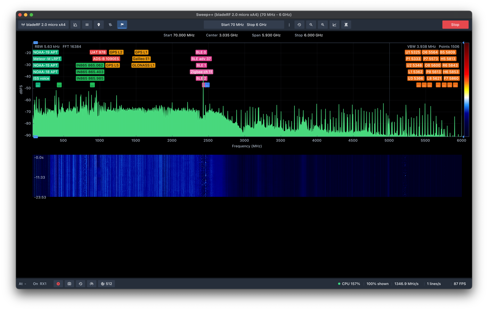
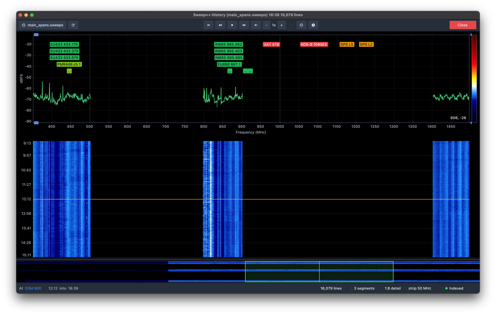

# User guide

This guide walks through the Sweep++ window from top to bottom, then covers
recording, the History viewer, and where your settings are kept.

If you have never opened Sweep++ before, start with
[First steps](../README.md#first-steps) in the README.

- [The window](#the-window)
- [Choosing a radio](#choosing-a-radio)
- [Setting the range](#setting-the-range)
- [The Analysis panel](#the-analysis-panel)
- [Spectrum and waterfall](#spectrum-and-waterfall)
- [Markers](#markers)
- [Band and channel labels](#band-and-channel-labels)
- [Detections](#detections)
- [Antennas and inputs](#antennas-and-inputs)
- [Recording](#recording)
- [The History viewer](#the-history-viewer)
- [Snapshots](#snapshots)
- [Appearance and profiles](#appearance-and-profiles)
- [Keyboard and mouse](#keyboard-and-mouse)
- [Where settings are stored](#where-settings-are-stored)

## The window

### Top bar

From left to right:

| Control                 | What it does                                                                                                                          |
|-------------------------|---------------------------------------------------------------------------------------------------------------------------------------|
| **Device**              | Shows the open radio, or "Select device". Opens the device panel: pick a radio, change its settings, assign antennas.                 |
| **Analysis**            | Resolution, window, averaging and speed. See [The Analysis panel](#the-analysis-panel).                                               |
| **Menu**                | Display, Theme, Appearance, Profiles, Antennas, Data contributors, a section for each plugin with settings, Plugins, and Application. |
| **Markers**             | The marker list and marker presets. See [Markers](#markers).                                                                          |
| **Bands**, **Channels** | Turn the band-plan and channel labels on and off. Right-click either for its list. These two buttons come from plugins.               |
| **Range** (centre)      | Shows what is being swept. Click it to change the range.                                                                              |
| **Zoom**                | Reset zoom, zoom out, zoom in.                                                                                                        |
| **Chart**               | Spectrum drawing options: smoothing, number of display points, fill under the trace.                                                  |
| **Waterfall**           | Waterfall options. See [Spectrum and waterfall](#spectrum-and-waterfall).                                                             |
| **Start / Stop**        | Start or stop the radio.                                                                                                              |

Under the top bar, a row shows the **Start**, **Center**, **Span** and **Stop**
of what is on screen.

### Status bar

From left to right:

- **What is here.** Names what the band plan and channel lists say is at the
  selected marker, or at the centre of the view when no marker is selected.
- **RX port.** Only on radios with more than one input. Shows which connector
  and antenna are in use, and whether antenna routing is on.
- **Save now.** Saves the recording so far to a `.sweeps` file. See
  [Recording](#recording).
- **Snapshot.** Copies a picture of the spectrum and waterfall. See
  [Snapshots](#snapshots).
- **History.** Opens the History viewer in a new window.
- **Performance.** Opens the Performance window.
- **Detections.** Opens the detections window. This button comes from the
  detections plugin.

On the right are the health readouts: CPU use, how much of the incoming data is
being shown, sweep speed in MHz/s, waterfall lines per second, and frames per
second. The dot next to the CPU figure means:

- **green:** no samples are being dropped;
- **amber:** some samples are being dropped;
- **red:** more than 1% of samples are being dropped.

If the dot is amber or red, the computer can't keep up. Lower the sample rate,
use fewer averages or a coarser resolution, or open **Performance** to see
where the time goes.

### Performance window

- **Input:** how full the USB link and buffers are, sample rate, dropped
  samples, overruns and gaps. **Reset** clears the counters.
- **Device:** temperatures, power and similar readings, for radios that
  report them (currently bladeRF 2.0).
- **Processing:** how much of the data is analysed, FFT rate and latency,
  worker threads, sweep passes and retunes.
- **Output:** frames per second, waterfall lines per second, CPU and uptime.
- **Frame consumers:** frames delivered and dropped, and the slowest callback,
  for each consumer, so a recorder falling behind is told apart from the radio
  dropping samples.

## Choosing a radio

Click the **Device** button. When no radio is open, it lists every radio
Sweep++ can see, with its name, driver and serial number. Click one to open
it, or **Refresh** after plugging one in.

The **Synthetic signal generator** is always listed. It makes up signals, so
you can try Sweep++ with no hardware.

With a radio open, the panel shows:

- its serial number (click to copy), firmware and FPGA versions, and USB link
  type. A version newer than Sweep++ knows about is shown in amber;
- the radio's own settings: sample rate, gains, filters, bias-T and so on.
  These come from the radio's driver, so they differ between radios. A setting
  that can only change while stopped is greyed out while the radio runs;
- the **Antennas** section. See [Antennas and inputs](#antennas-and-inputs);
- **Change device** and **Close device**.

Sweep++ reopens the last radio you used the next time it starts.

[Supported devices](devices.md) describes each radio's settings.

## Setting the range

Click the range button in the middle of the top bar.

- **One range.** Type a start and stop frequency, or switch to centre and
  span. Each field has ±100, ±10 and ±1 MHz buttons.
- **Multiple ranges.** Tick **Multiple ranges** to get a row per range. Use
  **Add range** to add one and **x** to remove one. The gaps between ranges
  are skipped, so they cost no time.
- **Full device range** sets the range to everything the radio can tune.
- **Antenna range(s)** sets the range to what your assigned antennas cover.
- A warning appears if the range is outside what the radio can tune.

### Presets

The range panel has 12 built-in presets: FM broadcast, Airband, 2 m amateur,
70 cm amateur, ISM 433, ISM 868, ISM 915, LTE downlink, GPS L1, Wi-Fi 2.4G,
Wi-Fi 5G and Full range.

- Click a preset to sweep it.
- **Alt-click** a preset, or click its **+**, to add it to the ranges you
  already have.
- Click the star to make it a favourite.
- Save the current ranges as a preset of your own.
- Click **x** on a built-in preset to hide it.
- Presets your radio can't reach are greyed out.

### Selecting a range with the mouse

Hold keys while dragging across the spectrum or the waterfall:

| Drag with                                      | Does                                           |
|------------------------------------------------|------------------------------------------------|
| **Shift**                                      | Zoom to that band.                             |
| **Shift + Ctrl** (**Shift + Cmd** on macOS)    | Sweep only that band (red selection).          |
| **Shift + Ctrl + Alt** (**Shift + Cmd + Alt**) | Add that band to the ranges (green selection). |

Press **Esc** during the drag to cancel it.

**Backspace** goes back to the previous range or view, and
**Shift + Backspace** goes forward again.

### Fixed tune

In **Analysis**, untick **Sweep the planned range** to stay on a single centre
frequency instead of sweeping. The radio then shows only what fits in its own
bandwidth, but updates much faster.

## The Analysis panel

Click **Analysis** in the top bar. **Simple** shows the settings most people
need; **Advanced** shows all of them.

### Sweep

- **Priority:** **Fast** takes one measurement per step and moves on.
  **Detail** averages more at each step, so it lowers the noise but sweeps more
  slowly.
- **Route by antenna:** see [Antennas and inputs](#antennas-and-inputs).

### Resolution

- **Simple:** set the **RBW** (resolution bandwidth) directly, from 0.05 to
  1000 kHz. A narrower RBW separates signals that are close together, but
  sweeps more slowly.
- **Advanced:** pick the number of **FFT points**, from 64 to 1,048,576. The
  RBW follows from the sample rate, the window and the FFT points.

### Advanced settings

- **Window:** Rectangular, Hann, Hamming, Blackman-Harris, Flat-top or Kaiser
  (with a beta setting). Hann is a good default; Flat-top reads levels most
  accurately; Blackman-Harris is best at showing a weak signal next to a strong
  one.
- **Overlap:** how much each FFT shares with the one before it. More overlap
  catches short bursts better and uses more CPU.
- **Max hold decay:** how fast the max-hold trace falls, from 0 (never) to
  60 dB per second.
- **Frame rate:** caps how often the display redraws. It does not change what
  is measured.
- **Averages:** 1 to 64. More averages give a smoother noise floor but blur
  short bursts.
- **Stitching** (while sweeping):
  - **Usable band:** how much of each step is kept. The edges of a radio's
    bandwidth are less accurate, so they are cropped.
  - **Step overlap:** extra overlap between steps so there are no gaps.
  - **LO guard:** removes the spike many radios show at the centre of each
    step. Once corrections are learned (below), set it to 0 for about twice the
    sweep speed.
- **Corrections:** what the receiver adds on its own, removed from every frame.
  - **DC removal:** removes the LO spike at the centre of each step. On by
    default. A carrier sitting exactly on the LO is removed with it.
  - **Flatten floor:** subtracts the learned floor shape, levelling the hump
    around each step's LO. Greyed out until learned, and marked **stale** when
    a gain, bandwidth or sample rate differs from when it was learned: learn
    again at the new setting. A signal close to a step's LO can read low by up
    to the hump's height.
  - **Spur mask:** replaces the learned spurs with a line between their
    neighbours.
  - **Auto spurs** (sweeping): keeps looking for LO-offset spurs the mask does
    not cover yet and adds them for this session. Never saved. **Clear auto
    spurs** drops them.
  - **Learn:** disconnect the antenna (or fit a 50 Ω load), start
    acquisition, press it. Sweeping, it takes about ten passes: one for the
    floor and the LO-offset spurs, the rest through them for spurs at fixed
    frequencies. Fixed tune, it takes 200 frames. The result is saved per
    radio under `calibration/` in the [config folder](#where-settings-are-stored)
    and applied whenever that radio is opened. **Clear** forgets it.
- **Backend:** which FFT engine does the maths. **Bench** opens the FFT
  benchmark, which times every installed engine on your computer and offers to
  switch to the fastest.
- **Throttle:** **Auto** analyses as much as the computer keeps up with.
  **All samples** analyses everything. **Every Nth** analyses one buffer in N.
- **Workers:** how many CPU threads do the analysis. Auto uses all cores but
  two.

### Predicted

The bottom of the panel shows what the current settings will do: the number of
steps, FFT size, the actual RBW, the time for one pass, the sweep speed, and
how much of each pass is spent retuning. Use it to tune the settings before you
press Start.

## Spectrum and waterfall

### Spectrum

- The horizontal axis is frequency in MHz; the vertical axis is level in dBFS
  (decibels relative to the radio's full scale).
- **Traces:** the live trace, plus **Max hold**, **Min hold** and **Average**,
  switched on in **Menu → Display**. **Reset holds** clears them.
- Narrow signals stay visible when zoomed out: each column of pixels shows the
  highest and lowest value it covers.
- Drag the handles on the level axis to change the top and bottom of the scale.
- The text along the top shows the RBW, FFT size and gains on the left, and the
  VBW and display points on the right.

### Waterfall

- A new line is added once per complete sweep.
- Lines are stored at full resolution, so you can zoom into old data.
- Scroll over the time axis, or drag it, to look back in time.
- Drag the two handles on the colour bar to the right of the spectrum to set
  the waterfall's colour range.
- Drag the divider between the spectrum and the waterfall to resize them.

The **Waterfall** popover in the top bar has:

- **Pause**, which freezes the waterfall and shows a PAUSED badge;
- **Peak detect**;
- **History**, how many lines are kept in memory for scrolling back, with the
  memory used and roughly how much time that covers. This is only the live
  view. The recording keeps everything; see [Recording](#recording);
- **Time axis** (off, left or right) and **Time lines**;
- the colour range, **Edit gradient**, **Clear** and **Reset settings**.

### Zoom and pan

- Scroll to zoom around the pointer.
- Drag to pan, or **Shift**-scroll, or scroll sideways.
- **Shift**-drag to zoom to a band.
- The zoom buttons in the top bar zoom in, zoom out and reset.

## Markers

A marker reads the level at one frequency.

- **Right-click** the spectrum to move the selected marker there, or to place a
  new one if none is selected. Hold the right button and drag to slide it.
- **Ctrl + right-click** (**Cmd** on macOS) adds another marker.
- **Click** near a marker to select it.
- **Backspace** deletes the selected marker.

The **Markers** panel in the top bar lists every marker with its frequency,
level and what is at that frequency. For each one you can:

- show or hide it;
- edit it: type an exact frequency, or use the ±100, ±10 and ±1 MHz buttons;
- turn on **Peak** so it follows the strongest signal nearby;
- delete it.

**Add at centre** adds a marker in the middle of the view, and **Clear all**
removes every marker.

**Marker presets** save a set of markers. Click one to replace your markers
with it, or **Alt-click** (or **+**) to add to them. Click the star to make it
a favourite.

### Readout card

The selected marker's frequency, level and label are shown on a card over the
waterfall. When there is another marker before it, the card also shows the
start, end, centre and span between the two, the level difference, and the
strongest signal between them. Choose where the card sits, or hide it, in
**Menu → Display → Readout**.

## Band and channel labels

The **Bands** and **Channels** buttons show labels over the spectrum:

- **Bands** are wide allocations from a band plan, such as "Broadcasting" or
  "Amateur". They are drawn as bars.
- **Channels** are specific channels, such as Wi-Fi channel 6 or an FPV
  raceband channel, and single frequencies such as beacons. They are drawn as
  flags.

What you can do with them:

- **Hover** a label to see what it is.
- **Click** a label to mark its exact extent on the spectrum. Click again to
  clear it.
- **Ctrl-click** (**Cmd-click**) a label to hide it.
- When there are more labels than fit, a **…** chip appears. Hover it to see a
  list of everything at that spot.
- Right-click **Bands** or **Channels**, or press **Shift+B** or **Shift+C**,
  to open a tree where you choose which bands or channels are shown.
- Press **B** or **C** to turn them all on or off.

Labels too narrow to see at the current zoom are left out. They come back when
you zoom in, and the status bar still names them.

### Data contributors

Several sources can name the same frequency: a band plan might say "2.4 GHz
ISM" while a channel list says "Wi-Fi channel 6". **Menu → Data contributors**
decides which one comes first. Drag the sources into the order you want. For
each one you can also:

- untick **show on spectrum** to stop it drawing labels, while still naming
  what is under the marker;
- choose a dataset, for a source that has more than one (for example which
  band plan).

To add your own channels or band plans, see [Plugins](plugins.md#your-own-data).

## Detections

Detections finds signals automatically and keeps a history of when each one was
active. Click **Detections** in the status bar to open its window.

- **On plot** paints detected signals on the spectrum.
- **Threshold:**
  - **Above noise** detects anything a set margin (1–40 dB, 10 by default) above
    the noise floor.
  - **Fixed** detects anything above a set level in dBFS.
- **Graph** shows each signal's activity over time (**When**) or its level
  (**Level**), over the last 1, 4 or 30 minutes.
- **Sort** by first seen, last seen, frequency, level or number of sightings.
- **Hold** is how long a signal stays in the Active list after it was last
  heard, before it moves to History.
- **Bands and tuning** sets the minimum width, merge gap and hysteresis per
  frequency band. There are defaults for HF, VHF, UHF, L band, 2.4 GHz ISM,
  5 GHz and microwave. **Follow the swept range** adjusts to what you are
  sweeping.
- **Ignore ranges** lists frequencies to leave out, each with a note. **Add the
  swept span** adds the range currently being swept.

The **Active** and **History** tables show each signal's frequency, width,
level, when it was last seen, how often it repeats, and a small activity graph.
From there you can ignore or forget a signal.

At the bottom, **Export CSV** and **Export TOML** save the list, and **Clear
history** starts again. Detections are also written into the recording.

## Antennas and inputs

Sweep++ can keep track of your antennas and which connector each one is on.

### The antenna library

**Menu → Antennas** lists your antennas. Each has a name, type, frequency range,
gain, whether it needs bias-T power, and notes. Use **Add antenna** to add one.

Four starter antennas are included: a wideband discone, a telescopic whip, a
dual-band 2.4/5 GHz patch and an active ADS-B antenna. You can't delete them,
but editing one saves your own copy in its place.

### Assigning antennas

Open the **Device** panel and scroll to **Antennas**. There is one row per input
(or a single row on radios with one input). Pick an antenna for each, or choose
**New antenna…**.

The panel shows:

- which input is being listened to right now;
- how much of your planned range the assigned antennas cover;
- a warning when an antenna needs bias-T and the input can't provide it, or
  bias-T is switched off;
- **Uncovered ranges**, on radios with more than one input: which connector to
  use for frequencies no antenna covers.

Turn on **Menu → Display → Antenna ranges** to shade each antenna's coverage on
the spectrum.

### Routing by antenna

On radios with more than one input, tick **Route by antenna** in the Analysis
panel. Sweep++ then switches inputs during the sweep, so each band is received
through an antenna that covers it.

When two antennas cover the same band, **When both cover it** decides which one
is used:

- **Tightest fit:** the antenna with the narrowest range;
- **Port order:** the first input;
- **Most gain:** the antenna with the highest gain;
- **Fewest switches:** stay on the current input for as long as it covers the
  band.

The panel warns about ranges no antenna covers, and shows how many times per
pass the input changes. Some radios have to stop briefly to switch inputs, and
the predicted pass time includes that.

## Recording

Recording is automatic. Every time you press **Start**, Sweep++ records into a
working file in your [sessions folder](#where-settings-are-stored). There is no
separate record button.

- **Save now** in the status bar saves everything recorded so far to a `.sweeps`
  file you choose, and starts a fresh working file.
- When you quit, Sweep++ asks whether to **Save…** or **Discard** the session.
- If Sweep++ closes unexpectedly, the unsaved session is kept as
  `recovered-<time>.sweeps` in the sessions folder.

Changes to the radio's settings during a recording, and signals the detections
plugin finds, are saved in the file too.

For how much memory the live waterfall keeps, see the **History** setting under
[Waterfall](#waterfall). That setting doesn't limit the recording.

## The History viewer

The History viewer opens `.sweeps` recordings. It runs as a separate window, so
the live view keeps running while you look back. It never touches your radio
and never changes your settings.

### Opening a recording

- Click **History** in the status bar. It opens on the session being recorded,
  if there is one.
- Run `sweeppp --history file.sweeps`, or just `sweeppp file.sweeps`.
- Drag a `.sweeps` file onto the window.
- On macOS, double-click the file in Finder.
- On Windows, run `register-sweeps.cmd` once, then double-click the file.

### Toolbar

- **Open session** opens another file.
- **Live** opens the session being recorded right now.
- **Reload** re-reads the file without moving the playhead, to pick up what has
  been recorded since.
- **Playback controls**, in the middle: jump to the start, step back, play or
  pause, step forward, jump to the end, and **−** / **+** to change the speed
  (0.1× to 16×).
- **Reset view** goes back to the start.
- **View** sets the overview strip's band width and the playback speed.
- **Close** closes the recording.

### Panes

- **Spectrum**, at the top: the spectrum at the playhead, with the same traces,
  markers and labels as the live view.
- **Waterfall**, in the middle: the recording. The amber line is the playhead.
  - Click to move the playhead to that time.
  - Drag or scroll the time labels to move through the recording.
    **Shift**-scroll moves a page at a time.
  - **Ctrl**-scroll (**Cmd**-scroll) zooms in time. Double-click the time labels
    to reset.
  - Frequency zoom and pan work as in the live view.
- **Overview strip**, at the bottom: the whole recording at a glance, around
  the selected marker's frequency (or the whole range when there is no marker).
  A box shows the part on screen.
  - Click or drag to jump.
  - Scroll to move, with **Shift** for bigger steps.
  - Drag its top edge to change its height.

### Status bar

- What is at the marker, and how far into the recording the playhead is.
- **playing N×** while playing.
- The number of lines in the recording.
- **segments:** a new segment starts whenever the range or resolution changed
  during recording.
- **full detail** or **1:N detail:** when zoomed out far, the viewer shows a
  reduced version so it stays fast. Zoom in for full detail.
- **Indexed** or **Rebuilt by scan:** "Rebuilt by scan" means the file wasn't
  closed properly (for example after a crash) and Sweep++ rebuilt its index.
  Nothing is lost.

## Snapshots

Click **Snapshot** in the status bar to copy a PNG of the frequency readout
row, the spectrum and the waterfall to the clipboard.

**Shift-click** saves it to a file instead: a save dialog opens in the sessions
folder with `sweeppp-<time>.png` suggested as the name.

## Appearance and profiles

### Theme and colours

**Menu → Theme**:

- **Theme:** dark, light or high contrast. Changes apply straight away.
- **Colour map:** 12 built-in colour schemes for the waterfall.
- **Gradient editor…:** add, move, recolour or remove colour stops, then
  **Apply**, or **Save as colormap** to keep it.
- **Save as:** type a name and click **Save** to keep the current theme,
  including colour-map changes. Saving under a built-in theme's name replaces
  it.

### Display

**Menu → Display**: grid, antenna range shading, max hold, min hold, average
(and how many frames it averages), **Reset holds**, the level range, the
waterfall colour range, and where the marker readout card goes.

### Appearance

**Menu → Appearance**: interface scale from 75% to 300% (**Match display**
picks one for your screen), text size and text weight.

### Profiles

A profile saves your whole setup under a name: the radio and its settings, the
ranges, analysis settings, display settings including markers, and plugin
settings.

In **Menu → Profiles**, type a name and click **Save**. Click a saved profile
to load it, or **x** to delete it.

Your current setup is also saved automatically when you quit, and restored the
next time you start.

### Application

**Menu → Application** shows the version, and has **Check for updates at
start-up** and **Open config folder**. When an update is available, a message
appears in the top-right corner with **Show** and **Stop checking** buttons.

## Keyboard and mouse

### Keys

| Key                   | Action                                                                                      |
|-----------------------|---------------------------------------------------------------------------------------------|
| **Backspace**         | Delete the selected marker. With no marker selected, go back to the previous range or view. |
| **Shift + Backspace** | Go forward to the next range or view.                                                       |
| **B**                 | Show or hide band labels.                                                                   |
| **Shift + B**         | Open the band list.                                                                         |
| **C**                 | Show or hide channel labels.                                                                |
| **Shift + C**         | Open the channel list.                                                                      |
| **Esc**               | Cancel a Shift-drag selection.                                                              |

Keys don't work while you're typing in a text field, and don't work in the
History viewer.

### Mouse, on the spectrum and waterfall

| Action                             | Does                                               |
|------------------------------------|----------------------------------------------------|
| Scroll                             | Zoom around the pointer.                           |
| Shift + scroll, or scroll sideways | Pan.                                               |
| Drag                               | Pan.                                               |
| Click                              | Select the nearest marker.                         |
| Right-click                        | Move the selected marker here, or place a new one. |
| Right-drag                         | Slide the selected marker.                         |
| Ctrl + right-click (Cmd on macOS)  | Add a marker.                                      |
| Shift + drag                       | Zoom to a band.                                    |
| Shift + Ctrl + drag                | Sweep only that band.                              |
| Shift + Ctrl + Alt + drag          | Add that band to the ranges.                       |
| Click a label                      | Mark its extent.                                   |
| Ctrl + click a label               | Hide it.                                           |
| Right-click a plugin button        | Open its panel.                                    |

## Where settings are stored

| System  | Folder                                                                 |
|---------|------------------------------------------------------------------------|
| macOS   | `~/Library/Application Support/sweeppp/`                               |
| Linux   | `$XDG_CONFIG_HOME/sweeppp/`, or `~/.config/sweeppp/` if that isn't set |
| Windows | `%APPDATA%\sweeppp\`                                                   |

Sweep++ Nightly uses `sweeppp-nightly` in place of `sweeppp`, unless *Share
settings with the Sweep++ release* is ticked in its settings.

**Menu → Application → Open config folder** opens it. To keep a separate
setup, start Sweep++ with `--config-dir <folder>` (see
[Command line](cli.md#sweeppp-the-gui)).

| File or folder                              | Holds                                                                           |
|---------------------------------------------|---------------------------------------------------------------------------------|
| `settings.toml`                             | Your current setup, saved when you quit.                                        |
| `app.toml`                                  | Interface scale, text size and weight, and the update check.                    |
| `sweep-presets.toml`, `marker-presets.toml` | Your range and marker presets.                                                  |
| `profiles/`                                 | Saved profiles.                                                                 |
| `themes/`, `colormaps/`                     | Your themes and colour maps.                                                    |
| `antennas/custom.toml`                      | Your antennas.                                                                  |
| `antennas/assignments.toml`                 | Which antenna is on which input.                                                |
| `bandplans/`, `channels/`                   | Your own band plans and channel lists. See [Plugins](plugins.md#your-own-data). |
| `plugins.toml`                              | Which plugins are turned off, and the Data contributors order.                  |
| `plugins/`                                  | Plugin settings, and plugins you install yourself.                              |
| `sessions/`                                 | Recordings, including the working file and recovered sessions.                  |
| `sweeppp.log`                               | The log.                                                                        |
| `sweeppp-crash-<time>.log`                  | Written if Sweep++ crashes. Please attach it when reporting a bug.              |

Built-in themes, band plans, channel lists and antennas ship with Sweep++. A
file of yours with the same name replaces the built-in one.
